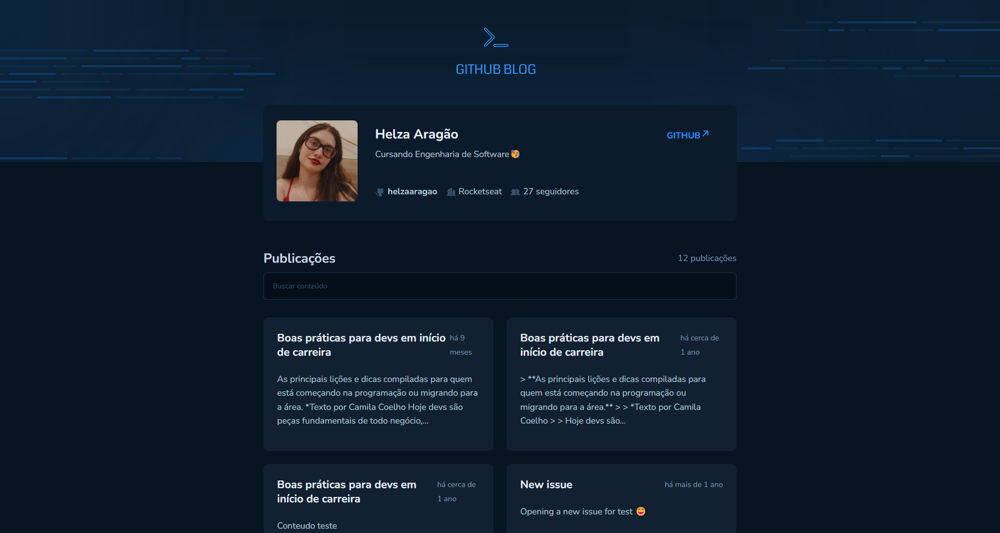

# 💻 GitHub Blog

<div>
  
  
  
</div>

Uma página **desktop** web que utiliza da API do GitHub para buscar issues de um repositório, dados do perfil e exibir elas como um blog. Desenvolvido com o design disponibilizado pela Rocketseat durante o curso de **ReactJS**.

*Imagem meramente ilustrativa, pois ela mudar dependendo do tamanho da tela do seu computador!


 

## 🚀 Funcionalidades

- **Listagem do perfil**: Exibe informações do perfil do GitHub, incluindo imagem, número de seguidores, nome e outros dados disponíveis na API.
- **Listagem de issues**: Lista todas as issues de um repositório, com um breve resumo do conteúdo de cada uma.
- **Barra de pesquisa**: Permite buscar issues por título e descrição, facilitando a localização de tópicos específicos.
- **Página com issue completa**: Disponibiliza uma página dedicada para exibir o conteúdo completo de cada issue (post).

## 📌 Desafios enfrentados 

Um dos principais desafios foi trabalhar com **requisições estáticas para buscar dados da API do GitHub**. Isso incluiu: Trazer informações do meu próprio perfil do GitHub e exibir issues de um repositório que não é de minha autoria, o que exigiu um cuidado adicional para garantir que os dados fossem carregados corretamente. **Um ponto crítico desse desafio foi assegurar a correlação entre os IDs**. Inicialmente, a lógica consistia em buscar o ID de cada issue e recuperar informações básicas, como título e descrição, para exibição na interface. No entanto, ao permitir que o usuário clicasse em um card para acessar os detalhes completos do issue, o ID associado ao card não correspondia ao issue correto, resultando no carregamento de um post inexistente. Esse problema exigiu uma revisão da lógica de renderização. 

A **solução** envolveu a garantia de que o ID dos issues fosse consistentemente mantido e utilizado ao navegar para a visualização detalhada do issue. Dessa forma, ao clicar em um card, o usuário é direcionado exatamente para o post correspondente, preservando a integridade e a usabilidade da aplicação.  


## 🌐 Deploy no GitHub Pages

O projeto está disponível online via GitHub Pages. Acesse <a href="helzaaragao.github.io/GitHubBlog/">aqui</a> para visualizar.


### 🛠️ Dependências e Versões Utilizadas

React: 18.3.1 | Typescript: 5.7.3 | Vite: 6.1.1 | Styled-components: 6.1.15 | Phosphor-icons/react: 2.1.7


### 📂 Como rodar o projeto na sua máquina local

OBS: é preciso já ter instalado o node.js, vscode ou um terminal da sua preferência para executar os comandos!

Clone esse repositório para os seus arquivos:
```
git clone https://github.com/helzaaragao/CoffeeDelivery.git
```

Depois, vá até a pasta que você acabou de criar com o comando anterior:

```
cd "CoffeeDelivery"
```
E instale todas as depedências e versões utilizadas por esse projeto:

```
npm install
```
Finalmente, rode no seu localhost:
```
npm run dev
```
