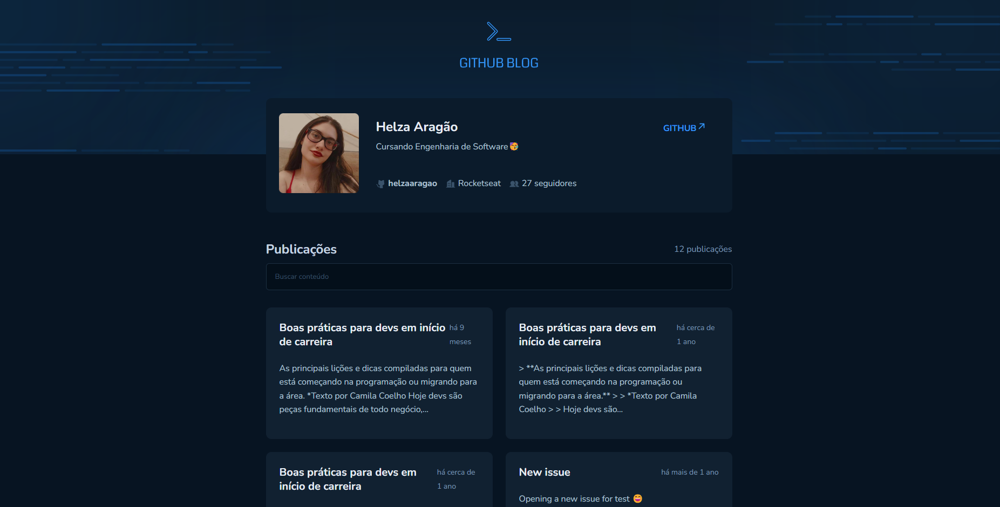

# 💻 GitHub Blog

<div>
  
  
  
</div>

Uma página **desktop** web que utiliza da API do GitHub para buscar issues de um repositório, dados do seu perfil e exibir elas como um blog. Desenvolvida com base no design disponibilizado pela Rocketseat durante o curso de ReactJS.

*Imagem meramente ilustrativa, pois ela muda dependendo do tamanho da tela do seu computador!
 

## 🚀 Funcionalidades

- Listagem do seu perfil com imagem, número de seguidores, nome e outras informações disponíveis pela API do GitHub.
- Listar e filtrar todas as issues do repositório com um pequeno resumo do conteúdo dela
- Barra de pesquisa que busque pelos títulos e descrição dos issues
- Criar uma página para exibir um post (issue) completo

## 📌 Desafios enfrentados 


## 🌐 Deploy no GitHub Pages

O projeto está disponível online via GitHub Pages. Acesse <a href="helzaaragao.github.io/GitHubBlog/">aqui</a> para visualizar.


### 🛠️ Dependências e Versões Utilizadas

React: 18.3.1 | Typescript: 5.7.3 | Vite: 6.1.1 | Styled-components: 6.1.15 | Phosphor-icons/react: 2.1.7


### 📂 Como rodar o projeto na sua máquina local

OBS: é preciso já ter instalado o node.js, vscode ou um terminal da sua preferência para executar os comandos!

Clone esse repositório para os seus arquivos:
```
git clone https://github.com/helzaaragao/CoffeeDelivery.git
```

Depois, vá até a pasta que você acabou de criar com o comando anterior:

```
cd "CoffeeDelivery"
```
E instale todas as depedências e versões utilizadas por esse projeto:

```
npm install
```
Finalmente, rode no seu localhost:
```
npm run dev
```
